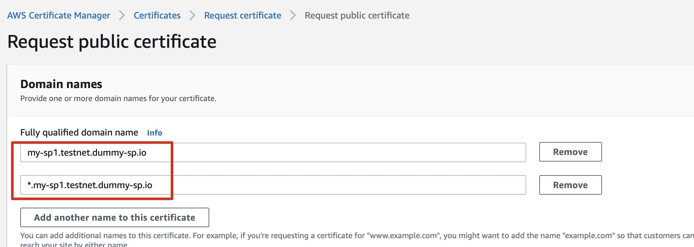

This guide helps you to set up a Storage Provider and add it to Greenfield testnet.

- [Prerequisites](#prerequisites)
  * [Recommended Hardware](#recommended-hardware)
  * [Wallet Preparation](#wallet-preparation)
  * [Databbase Configuration](#databbase-configuration)
  * [PieceStore Configuration](#piecestore-configuration)
  * [Gateway Configuration](#gateway-configuration)
- [Create Storage Provider](#create-storage-provider)
  * [1. Compile SP](#1-compile-sp)
  * [2. SP Testnet Config](#2-sp-testnet-config)
  * [3. Run SP](#3-run-sp)
  * [4. Deploy Dashboard](#4-deploy-dashboard)
- [Add Storage Provider to Greenfield testnet](#add-storage-provider-to-greenfield-testnet)
  * [Fee Table](#fee-table)
  * [1. Authorization](#1-authorization)
  * [2. Submit-proposal](#2-submit-proposal)
  * [3. Deposit BNB to proposal](#3-deposit-bnb-to-proposal)
  * [4. Wait voting and check voting result](#4-wait-voting-and-check-voting-result)
- [Storage Provider Operations](#storage-provider-operations)
  * [Deposit collateral](#deposit-collateral)
  * [EditStorageProvider](#editstorageprovider)
- [Verify Functions](#verify-functions)
- [Trouble shooting](#trouble-shooting)


## Prerequisites

### Recommended Hardware

The following lists the recommended hardware requirements:

* VPS running recent versions of Mac OS X, Linux, or Windows；
* 16 cores of CPU, 64 GB of memory(RAM);
* 1 Gbps network connection with upload/download speeds of 10MB/s+；
* At least 1 TB disk space for backend storage;
* 50GB+ SQL database;
* Piece Store: AWS S3, MinIO(Beta);
* 6 Greenfield accounts with enough BNB tokens.

:::danger IMPORTANT
Each storage provider will hold 7 different accounts serving different purposes
:::

### Wallet Preparation

* Operator Account: Used to edit the information of the StorageProvider. Please make sure it has enough BNB to deposit the create storage provider proposal(1 BNB) and pay the gas fee of `EditStorageProvider` and `UpdateStorageProviderStatus` transactions.
* Funding Account: Used to deposit staking tokens and receive earnings. It is important to ensure that there is enough money in this account, and the user must submit a deposit as a guarantee. At least **1000+** BNB are required for staking. You should use this address to send `CreateValidator` proposal on-chain. 
* Seal Account: Used to seal the user's object. Please make sure it has enough BNB to pay the gas fee of `SealObject` transaction.
* Approval Account: Used to approve user's requests. This account does not require holding BNB tokens.
* GC Account: It is a special address for sp and is used by sp to clean up local expired or unwanted storage. Please make sure it has enough BNB tokens because it's going to keep sending transactions up the chain.
* Maintenance Account: It is used for SP self-testing while in maintenance mode. This account for creating bucket and object will be allowed-listed by Chain while other users' create request will fail.
* Bls Account: Used to create bls signature when sealing objects to ensure integrity, it does not need to be deposited. 

You can use the below command to generate these seven accounts:

```shell
./build/bin/gnfd keys add operator --keyring-backend os
./build/bin/gnfd keys add funding --keyring-backend os
./build/bin/gnfd keys add seal --keyring-backend os
./build/bin/gnfd keys add approval --keyring-backend os
./build/bin/gnfd keys add gc --keyring-backend os
./build/bin/gnfd keys add maintenance --keyring-backend os
./build/bin/gnfd keys add bls --keyring-backend os --algo eth_bls
```

and then export these private keys to prepare for SP deployment:

```shell
./build/bin/gnfd keys export operator --unarmored-hex --unsafe  --keyring-backend os
./build/bin/gnfd keys export funding --unarmored-hex --unsafe  --keyring-backend os
./build/bin/gnfd keys export seal --unarmored-hex --unsafe --keyring-backend os
./build/bin/gnfd keys export approval --unarmored-hex --unsafe --keyring-backend os
./build/bin/gnfd keys export gc --unarmored-hex --unsafe --keyring-backend os
./build/bin/gnfd keys export bls --unarmored-hex --unsafe --keyring-backend os
```

maintenance account is not needed for SP deployment, but you should export it to conduct self-test:

```shell
./build/bin/gnfd keys export maintenance --unarmored-hex --unsafe --keyring-backend os
```

Please keep these seven private keys safe!

Also, obtain bls public key, bls proof to fill in the proposal of creating Storage Provider

bls_pub_key: 
```shell
./build/bin/gnfd keys show bls --keyring-backend os --output json | jq -r '.pubkey_hex' 
```
bls_proof:
```shell
./build/bin/gnfd keys sign "${bls_pub_key}"   --from bls --keyring-backend os
```


### Database Configuration

You should create two databases: `${SpDB.Database}` and `${BsDB.Database}`. Both values can be found in [configuration file](../../../guide/storage-provider/run-book/config.md).

:::danger IMPORTANT
`${BsDB.Database}` requires the **utf8mb4_unicode_ci** as the character set and collation.
:::

The following example assumes `${SpDB.Database}` as `storage_provider_db` and `${BsDB.Database}` as `block_syncer`. 

```shell
# login in mysql and create database
# the default encoding for the database should be utf8mb4_unicode_ci
mysql> CREATE DATABASE storage_provider_db;
mysql> CREATE DATABASE block_syncer;
# check the database encoding format
mysql> show create database block_syncer;
```
This is the encoding we expect to see

| Database | Create Database |
|----------|-----------------|
|blocl_syncer |  CREATE DATABASE `block_syncer` /*!40100 DEFAULT CHARACTER SET utf8mb4 COLLATE `utf8mb4_0900_ai_ci` */|


### PieceStore Configuration

Please follow this [doc](./piece-store) to config your PieceStore.

### Gateway Configuration

#### 1. Support both path-style and virtual-style routers in https certificates

You need certificates for SP's exposed gateway service domain name and wildcard subdomain name of it, say you exposed your SP's gateway service on https://my-sp1.testnet.dummy-sp.io, then you need SSL certificates for both `my-sp1.testnet.dummy-sp.io` and `*.my-sp1.testnet.dummy-sp.io`.
For instance, if you reqeust AWS ACM certificate, you could request with this:


Also, route all traffic from both `my-sp1.testnet.dummy-sp.io` and `*.my-sp1.testnet.dummy-sp.io` to gateway service, for instance, if you use nginx for ingress control, then you'll need to configure rules look like the following:
```yaml
rules:
  - host: my-sp1.testnet.dummy-sp.io
    http:
      paths:
      - backend:
          service:
            name: gateway # where your SP gateway service is internally, such a k8s service.
            port:
              number: 9033
        path: /
        pathType: ImplementationSpecific
  - host: '*.my-sp1.testnet.dummy-sp.io'
    http:
      paths:
      - backend:
          service:
            name: gateway # the same with the above one.
            port:
              number: 9033
        path: /
        pathType: ImplementationSpecific
```
#### 2. Cross Region Configuration
When working with web applications (e.g. DCellar),  SPs need to allow cross region requests.
See : https://developer.mozilla.org/en-US/docs/Web/HTTP/CORS/Errors

If CORS is not configured properly, you may find the DCellar (or any other web applications which mean to interact with your SP) will report CORS errors, similar to below:


Most people run their SP services behind the nginx or other similar reverse proxies. Usually the CORS settings should be configured in those reverse proxies.

We recommend SP with reverse proxy can return the following headers:

```
access-control-allow-headers: *
access-control-allow-methods: *
access-control-allow-origin: *
access-control-expose-headers: *
```

After you finish the configuration, you can verify if it works in DCellar.
1. Go to https://dcellar.io
2. Press F12 to launch web developer tools and go to "Network" tab.
3. Connect your wallet
4. Find the "OPTIONS" request to your SP and check its status and response headers. If you see a similar result to the following screenshot, it means your CORS configuration is correct.


## Create Storage Provider

### 1. Compile SP

[Compile SP doc](./compile-dependences.md#compile-sp).

### 2. SP Testnet Config

#### Generate config template

```shell
cd greenfield-storage-provider/build

# dump default configuration
./gnfd-sp config.dump
```

#### Write config

You can learn about how to write your `config.toml` file [here](./config)

It's recommended to deploy Kubernetes cluster following this [guide](https://github.com/bnb-chain/greenfield-sp-deployment/blob/main/docs/README.md). The corresonding config file is [here](https://github.com/bnb-chain/greenfield-sp-deployment/blob/main/docs/k8s/aws/config.toml).


### 3. Run SP

```shell
# start sp
./gnfd-sp --config ${config_file_path}
```
### 4. Deploy Dashboard

You can prepare your monitoring dashboard following [this guide](./infra-deployment/grafana/grafana.md)


## Add Storage Provider to Greenfield testnet

Greenfield Blockchain validators are responsible for selecting storage providers. For each on-chain proposal to add new storage provider, there are deposit period for depositing BNB and voting period for validators to make votes. Once the proposal passes, new SP can join the network afterwards.

You can query the governance parameters [here](https://docs.bnbchain.org/greenfield-docs/docs/greenfield-api/gov-v-1-params)


### Fee Table

| Transaction Type             | Fee         |
| ---------------------------- | ----------- |
| Submit Storage Provider Proposal  | 1 BNB      |
| Storage Provider Proposal Deposit | 0.00003 BNB |
| Edit Storage Provider     |  0.1BNB       |

### 1. Submit-proposal

The SP needs to initiate an on-chain proposal that specifies the Msg information to be automatically executed after the vote is approved. In this case, the Msg is `MsgCreateStorageProvider`. It's worth noting that the deposit tokens needs to be greater than the minimum deposit tokens specified on the chain.

```shell

./build/bin/gnfd tx sp create-storage-provider path/to/create_storage_provider.json --from funding  --node https://gnfd-testnet-fullnode-tendermint-us.bnbchain.org:443 --chain-id "greenfield_5600-1"

# create_sp.json
$ cat ./create_sp.json
{
  "messages":[
  {
    "@type":"/greenfield.sp.MsgCreateStorageProvider",
    "description":{
      "moniker": "sp0",
      "identity":"",
      "website":"",
      "security_contact":"",
      "details":""
    },
    "sp_address":"{operator_address}",
    "funding_address":"{funding_address}",
    "seal_address":"{seal_address}",
    "approval_address":"{approval_address}",
    "gc_address":"{gc_address}",
    "maintenance_address": "{maintenance__address}",
    "endpoint": "https://sp0.greenfield.io",
    "deposit":{
      "denom":"BNB",
      "amount":"1000000000000000000000"
    },
    "read_price": "0.108",
    "store_price": "0.016",
    "free_read_quota": 10000,
    "creator":"0x7b5Fe22B5446f7C62Ea27B8BD71CeF94e03f3dF2",
    "bls_key": "{bls_pub_key}",
    "bls_proof": "{bls_proof}"
  }
],
  "metadata": "4pIMOgIGx1vZGU=",
  "title": "Create <name> Storage Provider",
  "summary": "create <name> Storage Provider",
  "deposit": "1000000000000000000BNB"
}
```

#### Understanding the parameters

:::note
You can get the gov module address by this command

```shell
curl -X GET "https://gnfd-testnet-fullnode-tendermint-us.bnbchain.org/cosmos/auth/v1beta1/module_accounts/gov" -H  "accept: application/json"
```
:::

* `endpoint` is URL of your gateway
* `read_price` and `store_price` unit is `wei/bytes/s`
* `free_read_quota` unit is *Bytes*
* `creator` is the address of `gov module` 
* `metadata` is optional

### 2. Deposit BNB to proposal

:::note
You can get the mininum deposit for proposal by the above command. Please make sure that the initial deposit is greater than `min_deposit` when submitting the proposal.
```shell
curl -X GET "https://gnfd-testnet-fullnode-tendermint-us.bnbchain.org/cosmos/gov/v1/params/deposit" -H  "accept: application/json"
```
:::

You can skip this step if the initial deposit amount is greater than the min deposit required by the proposal.

Each proposal needs to deposit enough tokens to enter the voting phase.

```shell
./build/bin/gnfd tx gov deposit {proposal_id} 1BNB --from {funding_address} --keyring-backend os --node https://gnfd-testnet-fullnode-tendermint-us.bnbchain.org:443 --chain-id "greenfield_5600-1"
```

### 3. Wait voting and check voting result

After submitting the proposal successfully, you must wait for the voting to be completed and the proposal to be approved. It will last **7 days** on mainnet while **1 day** on testnet. Once it has passed and is executed successfully, you can verify that the storage provider has been joined.

:::caution

Please ensure that the storage provider service is running before it has been joined.

:::

You can check the on-chain SP information to confirm whether the SP has been successfully created.

```shell
./build/bin/gnfd query sp storage-providers --node https://gnfd-testnet-fullnode-tendermint-us.bnbchain.org:443
```

Alternatively, you can check the proposal to know about its execution status.

```shell
./build/bin/gnfd query gov proposal {proposal_id} --node https://gnfd-testnet-fullnode-tendermint-us.bnbchain.org:443
```

### 4. Activate SP

#### Storage Provider Standard Test
After the proposal has passed, the status of SP is `STATUS_IN_MAINTENANCE`. To prevent being slashed due to functional abnormalities, 
you should first perform a full functional test using the maintenance account. You can refer to the [SP standard test](https://github.com/bnb-chain/greenfield-sp-standard-test).

#### Update SP status
Once the testing is completed, you need to send a tx to activate the SP to `STATUS_IN_SERVICE`.

```shell
./build/bin/gnfd tx sp update-status [sp-address] STATUS_IN_SERVICE [flags]
```
Refer to [Maintenance Mode](../../core-concept/storage-provider-lifecycle.md#in-maintenance) for more details.

## Storage Provider Operations
### Deposit collateral

This command is used for the SP to supplement collateral, because if the service status of the SP is not good during operation, it will be slashed by users, resulting in the deduction of its deposit tokens.

```shell
gnfd tx sp deposit [sp-address] [value] [flags]
```

### EditStorageProvider

This command is used to edit the information of the SP, including endpoint, description and .etc.

```shell
gnfd tx sp edit-storage-provider [sp-address] [flags]
```
## Tools

SP can use Greenfield Cmd or DCellar to verify SP functions in Testnet:

* Greenfield Cmd: [repo](https://github.com/bnb-chain/greenfield-cmd)

* DCellar: [website](https://dcellar.io/)

## Trouble shooting

If you meet issues, please read [this doc](./common-issues).


