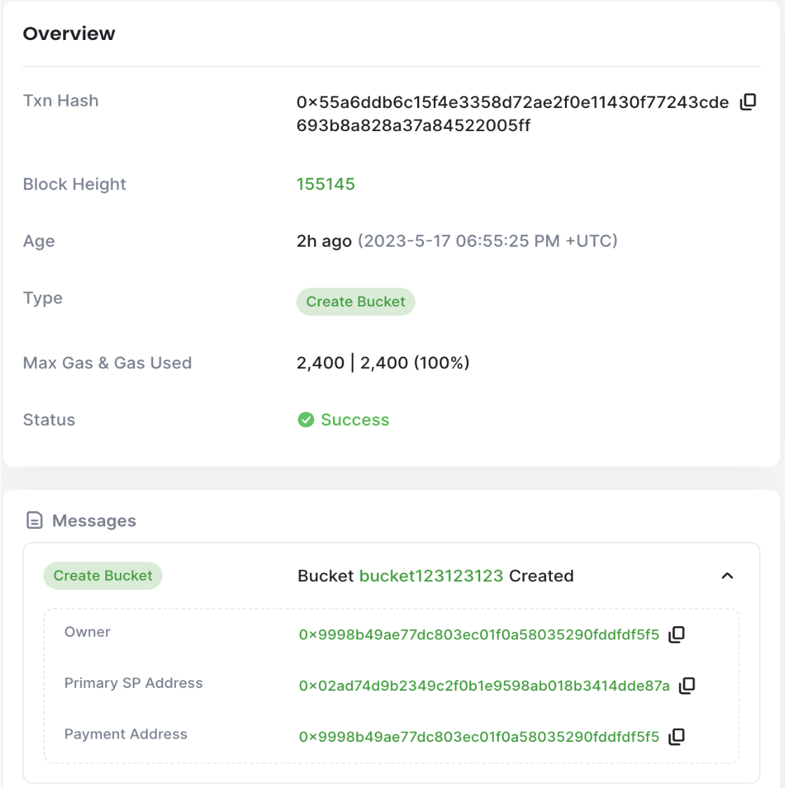

# Introduction to file management with CLI
## Introduction
Backing up files is an essential practice for any development process. The benefits initially might not seem straightforward, but backups provide a safety net for disaster recovery, ensuring that data can be restored in the event of hardware failures, accidental deletions, or natural disasters. 

Backups often encompass local changes and experiments outside of the repository, ensuring that valuable work is not lost and can be integrated into the main codebase. 
Furthermore, repositories may not effectively handle non-code files and operational documentation, making backups crucial for their preservation. By providing redundancy and data integrity, backups reduce the risk of relying solely on a single repository. They also facilitate long-term archiving, ensuring access to historical data even if repository policies change or there is a switch to a different provider. 

Traditional cloud storage services, while convenient, are centralized and often have clauses in their terms and conditions that allow them to share your data with third parties and government agencies. This is where BNB Greenfield, a new decentralized storage on BNB Chain, comes in as a more secure and private alternative for backing up your files.

In this tutorial, we will guide you through the process of setting up your environment, installing the necessary tools, and effectively backing up your files to BNB Greenfield, leveraging the benefits of decentralized storage while ensuring data security and ownership. 

We will also cover how to interact with the CLI tool, choose storage providers, manage your account balance, and manage buckets and uploaded files.

## Setting Up the Environment
### Installation

To begin, you will need to install the BNB Greenfield command line tool follow the instruction from CLI github page.

After installing, a basic configuration file is required for the CLI to work with the Greenfield testnet. Each CLI command should run with "-c filePath" to load the config file, and the config should be in toml format. The default config file is "config.toml".

Config file example will set up the necessary RPC address, chain id, and the name of the keychain password file:

```
rpcAddr = "https://gnfd-testnet-fullnode-tendermint-us.bnbchain.org:443"
chainId = "greenfield_5600-1"
passwordFile = "password.txt"
```
### Setting Up Identity and Generating Keystore File
To set up your identity on the local machine and generate a keystore file, you will need to create two files: key.txt and password.txt. These files will hold the identity private key and keystroke password, respectively.

To obtain your private key from Metamask, follow the instructions in this guide. While the password doesn’t have any restriction on the length or complexity, it’s better to follow generally recommended principles. Both the private key and the password should be stored plainly in the appropriate files. Once you have the files ready, run the following command:

```
gnfd-cmd keystore generate --privKeyFile key.txt --password password.txt key.json
```

This will create a keystore file and store it in key.json and will be picked up by the CLI for commands that require identity and payment. After generating the keystore file, make sure to delete the key.txt file with the private key inside.

## Interacting with BNB Greenfield
BNB Greenfield is built on a distributed architecture where storage providers play a crucial role. The network consists of multiple storage providers that offer their resources to store and retrieve data from users. When using BNB Greenfield, users have the flexibility to choose which storage providers to utilize based on several factors, including price, terms and conditions, and network performance.

When selecting storage providers, users can query the decentralized storage network through the CLI tool to obtain information about available providers. The list of providers will include their operator addresses and corresponding endpoints. Users can then analyze the providers based on the aforementioned factors and choose the ones that best align with their requirements. 

For the advanced use cases, users can diversify their storage across multiple providers to enhance redundancy and mitigate the risk of data loss. This approach distributes data among different providers, ensuring that even if one provider experiences issues, the data remains accessible from other providers. By carefully selecting storage providers based on price, terms and conditions, and network performance, users can optimize their decentralized storage experience and maintain control over their data while enjoying the benefits of enhanced security and privacy.

### Selecting Storage Providers
To query the network and get a list of storage providers, execute:

```
./gnfd-cmd sp ls
```

The result should display a list of storage providers. For testnet, there are several active storage providers, which can be used for development purposes.

```
SP list:
sp[0]: operator-address:0x02Ad74D9B2349c2f0B1e9598aB018B3414dDe87A, endpoint:https://gnfd-testnet-sp-1.nodereal.io, Status:STATUS_IN_SERVICE
sp[1]: operator-address:0x14361bB0E7f1A4d656588F08dC56836C9Feb2454, endpoint:https://gnfd-testnet-sp-4.bnbchain.org, Status:STATUS_IN_SERVICE
sp[2]: operator-address:0x169321fC04A12c16D0DaF30BBfD0c805D0223803, endpoint:https://gnfd-testnet-sp-5.bnbchain.org, Status:STATUS_IN_SERVICE
sp[3]: operator-address:0x216B1EA22422F930E4A157d6f38F7b12206c2A39, endpoint:https://gnfd-testnet-sp-7.bnbchain.org, Status:STATUS_IN_SERVICE
sp[4]: operator-address:0x33b22C9d21670f001fA430fe9f35239123978e79, endpoint:https://gnfd-testnet-sp-1.bnbchain.org, Status:STATUS_IN_SERVICE
sp[5]: operator-address:0xd8283E74d729B428712C2d393632Fc527B0F39CF, endpoint:https://gnfd-testnet-sp-2.bnbchain.org, Status:STATUS_IN_SERVICE
sp[6]: operator-address:0xdc5dFFfa5Fc0Addf4A3c32F8DB6F39E1554ecbcf, endpoint:https://gnfd-testnet-sp-3.bnbchain.org, Status:STATUS_IN_SERVICE
sp[7]: operator-address:0xEE380501A7fAA03CadBDF981B865064F824bC3EC, endpoint:https://gnfd-testnet-sp-6.bnbchain.org, Status:STATUS_IN_SERVICE
```

The price for each storage provider can be checked using the operator address, for example:

```
./gnfd-cmd sp get-price --spAddress 0x169321fC04A12c16D0DaF30BBfD0c805D0223803
```

The response will retrieve the price for reading the data, as well as for storing the data per second.

```
get bucket read quota price: 0.087 wei/byte
get bucket storage price: 0.0048 wei/byte
```

To deduce the price for gigabytes (GB) per month from the metric of data usage in wei/byte, one needs to multiply the result by 0.002783138807808, as there are 1,073,741,824 bytes in 1 GB, 2,592,000 seconds in a month (30 days * 24 hours * 60 minutes * 60 seconds), and 10^18 wei in 1 BNB. 

The result will be the price for storing or transferring data in gigabytes per month, expressed in BNB. This calculation takes into account the rate of data usage and the duration of a month. Following the returned rate of wei/byte/sec, the converted amounts are:

```
get bucket read quota price: 0.000241465581804 BNB/GB/month
get bucket storage price: 0.000013359066277 BNB/GB/month
```

Keep in mind that the pricing model and calculations may vary depending on the specific storage provider you are using. Always refer to the documentation or provider's information for accurate and up-to-date pricing details.

### Account Management
While BNB Smart Chain (BSC) and BNB Greenfield define their accounts in the same format, it's important to understand that they are two separate blockchains with distinct ledgers. As a result, users need to manage their balances separately on both BSC and BNB Greenfield blockchains. 

Users can acquire test BNB tokens for testing purposes by using a test faucet provided by BNB Greenfield which can be accessed at https://gnfd-bsc-faucet.bnbchain.org/. By visiting the faucet website, users can request a certain amount of test BNB tokens to be sent to their BSC testnet address. 

To transfer test BNB from the BSC testnet to BNB Greenfield, users can utilize the [dCellar](https://dcellar.io/) application. By using the dCellar application, users can initiate the transfer process from their BSC testnet address to their BNB Greenfield address.


The balance can be checked using the following command:

```
./gnfd-cmd bank balance --address 0x9998b49AE77DC803eC01f0a58035290fDDFDf5f5                           
```

And the result will be the current balance:
```
balance: 50000000000000000000BNB
```
### Object Operations

In BNB Greenfield objects and buckets are key components. Buckets are containers used to organize and manage data, while objects are the actual files stored within those buckets. Buckets serve as top-level storage units with unique names, and objects have unique identifiers within their respective buckets. Users can perform operations on objects, such as uploading, downloading, and deleting, while applying permissions and access controls at the bucket and object level. This structure allows for efficient storage, organization, and retrieval of data in a decentralized storage network.

To create a bucket one need to call the following storage make-bucket command with the desired bucket name.

```
./gnfd-cmd bucket create gnfd://bucket123123123           
```

The operation will automatically choose a storage provider and submit a transaction to BNB Greenfield blockchain to write the associated metadata. Alternatively you can provide storage provider address, that is operator-address, if a specific provider should be used. The result should look something similar to the following:                                                                

```
choose primary sp: https://gnfd-testnet-sp-1.nodereal.io
create bucket bucket123123123 succ, txn hash: 55A6DDB6C15F4E3358D72AE2F0E11430F77243CDE693B8A828A37A84522005FF
```

As you can see, the result returns a transaction hash, which one can inspect using the block scanner, e.g. https://greenfieldscan.com. Going to https://greenfieldscan.com/tx/0x55A6DDB6C15F4E3358D72AE2F0E11430F77243CDE693B8A828A37A84522005FF, will show all the details of the transaction. 



Notice that we in the details we can see the bucket owner details, moi; primary storage provider address, and the payment address. Since we haven’t created a separate payment account, our default account will serve as the payment account as well.

With regards to the storage provider address, if you remember, it was picked for us automatically as https://gnfd-testnet-sp-1.nodereal.io. And from Selecting Storage Providers section we can see that its address is indeed 0x02Ad74D9B2349c2f0B1e9598aB018B3414dDe87A.

Lastly, it’s time to upload a file, but before we upload anything, let’s create one with a sample text using the echo command as follows:

```
echo 'Random sample text' > test4.txt
```

Finally to upload the file to our newly created bucket bucket123123123, one needs to execute the following command:

```
./gnfd-cmd object put  --contentType "text/xml" --visibility private ./test4.txt  gnfd://bucket123123123/test4.txt
```
Notice that we’ve provided the visibility flag and made the file private. The successful result should be similar to the following: 

```
create object test4.txt on chain finish, txn Hash: F2E23F29BF78FCB69316B6A31173C80B15233C2C92720781A71EAC58FB4014E5
put object test4.txt successfully 
```

Similarly, going to https://greenfieldscan.com/tx/0xF2E23F29BF78FCB69316B6A31173C80B15233C2C92720781A71EAC58FB4014E5 will show the details of the file upload. Here, observe the transaction payload and scroll to the “visibility” attribute, which confirms the privacy status.

```
{"key":"visibility" "value":"\"VISIBILITY_TYPE_PRIVATE\"" }
```

After successfully uploading the file, let’s verify the content of the file and compare it to the one we’ve uploaded - they should be identical.
```
./gnfd-cmd object get gnfd://bucket123123123/test4.txt ./test4-copy.txt
```

The operation will download the file and output the length of the file, as follows:
```
download object test4.txt successfully, the file path is ./test4-copy.txt, content length:19
```

To validate the integrity of the file, we can compare its content to the originally uploaded one. Empty output confirms there are no differences.

```
diff test4.txt test4-copy.txt 
```
## Conclusion
Overall, backups during software development offer peace of mind, efficient recovery, and safeguarding of the project's integrity. They minimize downtime and prevent significant setbacks.

After gaining familiarity with the command line tool and BNB Greenfield through this tutorial, the next step is to explore and experiment with creating files, buckets, and permission groups. By creating multiple files and organizing them into buckets, users can gain hands-on experience with the storage capabilities of BNB Greenfield. 

It is highly recommended for users to engage in hands-on exploration by trying out different wallets and understanding the basic operations and permissioning mechanisms. This will provide a deeper understanding of how BNB Greenfield functions and how to effectively manage and secure data within the decentralized storage system. 

This practical experience will pave the way for comprehending more advanced topics discussed in future articles, such as programmability and BNB Greenfield's innovative concept of flow-based billing and asset monetization. By exploring the diverse functionalities and experimenting with different configurations, users can unlock the full potential of BNB Greenfield and unlock its new data economy concepts.
